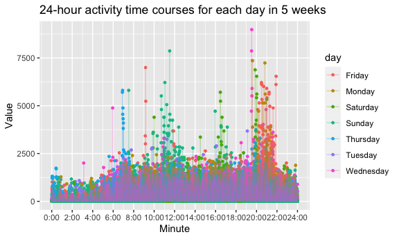

p8105\_hw3\_jl6049
================
LYU JING
10/14/2021

## Problem 1

**1. Load the data from the p8105.datasets**

``` r
library(p8105.datasets)
data("instacart")
```

**2. Do some exploration of this dataset**

``` r
instacart =
  instacart %>% 
  janitor::clean_names()

countaisle = count(instacart,aisle)
max_index = filter(countaisle,n == max(countaisle$n))$aisle
```

The dataset contains *1384617* observations of products information from
online grocery orders of *131209* distinct Instacart users.

The dataset has 15 columns, including:

**numeric variables:**

-   `order_id`
-   `product_id`
-   `add_to_cart_order`
-   `reordered`
-   `user_id`
-   `order_dow`
-   `order_hour_of_day`
-   `aisle_id`
-   `department_id`
-   `order_number`
-   `days_since_prior_order`

**character variables:**

-   `eval_set`
-   `product_name`
-   `aisle`
-   `department`

Every observation means a certain product in a user’s order. The
observation contains detail information of the product, the order and
the user.

-   For the product information, it has product id, order of each
    product was added to cart, prodcut has been ordered by this user in
    the past or not, name of the product, aisle of the product with
    aisle id and department of the product with department id.
-   For the order information, it has order id, evaluation set this
    order belongs in (train only),the order sequence number for this
    user, the day of the week on which the order was placed, the hour of
    the day on which the order was placed and days since the last order.
-   For the user information, it has user id.

**3. Answer the following questions**

1.  How many aisles are there, and which aisles are the most items
    ordered from?

There are **134** aisles.

The most items ordered from **fresh vegetables** whose frequency is
**150609**.

2.  Make a plot that shows the number of items ordered in each aisle,
    limiting this to aisles with more than 10000 items ordered. Arrange
    aisles sensibly, and organize your plot so others can read it.

``` r
instacart %>%
  count(aisle) %>% 
  filter(n > 10000) %>%
  mutate(
    aisle = fct_reorder(aisle,n)
    ) %>% #reorder/ranking
   mutate(
    stratify = case_when(
      n <=  20000 ~ "under 20000",
      (n > 20000)&(n < 40000) ~ "20000 to 40000",
      n > 40000      ~ "above 40000"
  )) %>% 
  ggplot(aes(x = aisle, y = n, label = n, fill = stratify)) +
  geom_text(check_overlap = TRUE, size = 2, hjust = 0, nudge_x = 0.07) +
  geom_bar(stat = "identity") +
  coord_flip() +
  labs(
    title = "The Number of Items Ordered in Each Aisle",
    x = "The number of items",
    y = "Aisle",
  )
```

<!-- -->

3.  Make a table showing the three most popular items in each of the
    aisles “baking ingredients”, “dog food care”, and “packaged
    vegetables fruits”. Include the number of times each item is ordered
    in your table.

``` r
most_popular = 
  instacart %>%
  filter(aisle == "baking ingredients" | aisle == "dog food care" | aisle == "packaged vegetables fruits") %>%
  group_by(aisle, product_name) %>% 
  summarize(count = n(),.groups = 'drop') %>% 
  mutate(order = min_rank(desc(count))) %>% 
  filter(min_rank(desc(count)) < 4) %>% 
  arrange(aisle,order)
  
knitr::kable(most_popular)
```

| aisle                      | product\_name        | count | order |
|:---------------------------|:---------------------|------:|------:|
| packaged vegetables fruits | Organic Baby Spinach |  9784 |     1 |
| packaged vegetables fruits | Organic Raspberries  |  5546 |     2 |
| packaged vegetables fruits | Organic Blueberries  |  4966 |     3 |

4.  Make a table showing the mean hour of the day at which Pink Lady
    Apples and Coffee Ice Cream are ordered on each day of the week;
    format this table for human readers (i.e. produce a 2 x 7 table)

``` r
meanhour_icecream = 
  instacart %>%
  filter(product_name == "Pink Lady Apples" | product_name == "Coffee Ice Cream") %>%
  
  group_by(product_name,order_dow) %>% 
  summarize(mean_hour = floor(mean(order_hour_of_day)),
            mean_min = 60*(round(mean(order_hour_of_day),1) - floor(mean(order_hour_of_day))),
            mean_time = paste(as.character(mean_hour),as.character(mean_min),sep = ":")
            ) %>% 
  mutate(order_dow = recode(order_dow , 
                            '0' = "Sunday",'1' = "Monday",'2' = "Tuesday",
                            '3' = "Wednesday",'4' = "Thursday",'5' = "Friday",'6' = "Saturday")) %>%
  select(order_dow,mean_time) %>% 
  pivot_wider(
    names_from = order_dow,
    values_from = mean_time
  ) 

knitr::kable(meanhour_icecream)
```

| product\_name    | Sunday | Monday | Tuesday | Wednesday | Thursday | Friday | Saturday |
|:-----------------|:-------|:-------|:--------|:----------|:---------|:-------|:---------|
| Coffee Ice Cream | 13:48  | 14:18  | 15:24   | 15:18     | 15:12    | 12:18  | 13:48    |
| Pink Lady Apples | 13:24  | 11:24  | 11:42   | 14:12     | 11:36    | 12:48  | 11:54    |

## Problem 2

**1. load the data from the p8105.datasets package.**

``` r
library(p8105.datasets)
data("brfss_smart2010")
BRFSS = brfss_smart2010
```

**2. do some data cleaning**

``` r
BRFSS = 
  BRFSS %>% 
  # format the data to use appropriate variable names
  janitor::clean_names() %>% 
  # focus on the “Overall Health” topic
  filter(topic == "Overall Health") %>% 
  # to make sure that "response" include only responses from “Excellent” to “Poor”
  # count(response)     
  # organize responses as a factor taking levels ordered from “Poor” to “Excellent”
  mutate(response = factor(response, levels = c("Poor", "Fair", "Good", "Very good", "Excellent"))) 
```

**3. do or answer the following (commenting on the results of each):**

1.  In 2002, which states were observed at 7 or more locations? What
    about in 2010?

*2002:*

``` r
BRFSS2002 = BRFSS %>%
  filter(year == "2002") %>% 
  count(locationabbr,locationdesc) %>% 
  group_by(locationabbr) %>%
  summarize(n_obs = n(),.groups = 'drop') %>% 
  filter(n_obs >= 7)

knitr::kable(BRFSS2002)
```

| locationabbr | n\_obs |
|:-------------|-------:|
| CT           |      7 |
| FL           |      7 |
| MA           |      8 |
| NC           |      7 |
| NJ           |      8 |
| PA           |     10 |

*2010:*

``` r
BRFSS2010 = 
  BRFSS %>%
  filter(year == "2010") %>% 
  count(locationabbr,locationdesc) %>% 
  group_by(locationabbr) %>%
  summarize(n_obs = n(),.groups = 'drop') %>% 
  filter(n_obs >= 7)

knitr::kable(BRFSS2010)
```

| locationabbr | n\_obs |
|:-------------|-------:|
| CA           |     12 |
| CO           |      7 |
| FL           |     41 |
| MA           |      9 |
| MD           |     12 |
| NC           |     12 |
| NE           |     10 |
| NJ           |     19 |
| NY           |      9 |
| OH           |      8 |
| PA           |      7 |
| SC           |      7 |
| TX           |     16 |
| WA           |     10 |

2.  Construct a dataset that is limited to Excellent responses, and
    contains, year, state, and a variable that averages the data\_value
    across locations within a state. Make a “spaghetti” plot of this
    average value over time within a state.

``` r
BRFSS_exc = 
  BRFSS %>%
  # limited to Excellent responses
  filter(response == "Excellent") %>% 
  group_by(year,locationabbr) %>% 
  # averages the data_value across locations within a state
  summarize(data_value_state_average = mean(data_value, na.rm = TRUE),.groups = 'drop' ) 

# Make a “spaghetti” plot of this average value over time within a state  
BRFSS_exc %>% 
  ggplot(aes(x = year, y = data_value_state_average, group = locationabbr)) + 
  geom_line(aes(color = locationabbr)) + 
  theme(legend.position = "right") + 
  labs(
    title = "Spaghetti plot of average data value within a state",
    subtitle = "2002 - 2010",
    y = "average data value within state"
  )
```

<!-- -->

3.  Make a two-panel plot showing, for the years 2006, and 2010,
    distribution of data\_value for responses (“Poor” to “Excellent”)
    among locations in NY State.

``` r
BRFSS %>%
  filter(locationabbr == "NY") %>% 
  filter(year == "2006" | year == "2010") %>% 
  group_by(year) %>% 
  ggplot(aes(x = response, y = data_value)) + 
  geom_violin(aes(fill = response), alpha = .5) + 
  stat_summary(fun = "median", color = "yellow") +
  coord_flip() +
  facet_grid(~year) +
  labs(
    title = "Distribution of data_value for responses",
    x = "Data_value of locations within NY state",
    y = "Responses"
  )
```

    ## Warning: Removed 5 rows containing missing values (geom_segment).

    ## Warning: Removed 5 rows containing missing values (geom_segment).

<!-- -->

## Problem 3

**1. Load, tidy, and otherwise wrangle the data.**

``` r
accelerometer_data = read_csv("./accel_data.csv",show_col_types = FALSE)
accelerometer_data =
  accelerometer_data %>% 
  janitor::clean_names() %>% 
  mutate(day_type = ifelse(day == 'Saturday'| day == 'Sunday' ,"weekend" ,"weekday"),
         day_id = recode(day, 
                             "Sunday" = '7', "Monday" = '1',"Tuesday" = '2',
                            "Wednesday" = '3',"Thursday" = '4',"Friday" = '5',"Saturday" ='6')) %>%
  pivot_longer(
    activity_1:activity_1440,
    names_to = "minute",
    names_prefix = "activity_",
    values_to = "value"
  ) %>% 
  mutate(minute = as.numeric(minute)) %>% 
  relocate(day_type) %>% 
  arrange(week,day_id,minute)
```

**Describe the resulting dataset (e.g. what variables exist, how many
observations, etc).**

There are 6 variables. It includes: day\_type : whether the day is a
weekday or a weekend week: the week number day\_id: numbers between 1 to
7, which mean Monday to Sunday accordingly day: Specific name of Monday
to Sunday minute: the minute when the colletion happened value: values
of accelerometer data

There are 50,400 observations in total.

**Using tidied dataset, aggregate accross minutes to create a total
activity variable for each day, and create a table showing these
totals.**

``` r
accelerometer_data_total =
  accelerometer_data %>% 
  group_by(week, day_id, day) %>% 
  summarise(total_activity = sum(value),.groups = 'drop') %>% 
  arrange(week,day_id) 

knitr::kable(accelerometer_data_total)
```

| week | day\_id | day       | total\_activity |
|-----:|:--------|:----------|----------------:|
|    1 | 1       | Monday    |        78828.07 |
|    1 | 2       | Tuesday   |       307094.24 |
|    1 | 3       | Wednesday |       340115.01 |
|    1 | 4       | Thursday  |       355923.64 |
|    1 | 5       | Friday    |       480542.62 |
|    1 | 6       | Saturday  |       376254.00 |
|    1 | 7       | Sunday    |       631105.00 |
|    2 | 1       | Monday    |       295431.00 |
|    2 | 2       | Tuesday   |       423245.00 |
|    2 | 3       | Wednesday |       440962.00 |
|    2 | 4       | Thursday  |       474048.00 |
|    2 | 5       | Friday    |       568839.00 |
|    2 | 6       | Saturday  |       607175.00 |
|    2 | 7       | Sunday    |       422018.00 |
|    3 | 1       | Monday    |       685910.00 |
|    3 | 2       | Tuesday   |       381507.00 |
|    3 | 3       | Wednesday |       468869.00 |
|    3 | 4       | Thursday  |       371230.00 |
|    3 | 5       | Friday    |       467420.00 |
|    3 | 6       | Saturday  |       382928.00 |
|    3 | 7       | Sunday    |       467052.00 |
|    4 | 1       | Monday    |       409450.00 |
|    4 | 2       | Tuesday   |       319568.00 |
|    4 | 3       | Wednesday |       434460.00 |
|    4 | 4       | Thursday  |       340291.00 |
|    4 | 5       | Friday    |       154049.00 |
|    4 | 6       | Saturday  |         1440.00 |
|    4 | 7       | Sunday    |       260617.00 |
|    5 | 1       | Monday    |       389080.00 |
|    5 | 2       | Tuesday   |       367824.00 |
|    5 | 3       | Wednesday |       445366.00 |
|    5 | 4       | Thursday  |       549658.00 |
|    5 | 5       | Friday    |       620860.00 |
|    5 | 6       | Saturday  |         1440.00 |
|    5 | 7       | Sunday    |       138421.00 |

``` r
ggplot(accelerometer_data_total, aes(x = day_id, y = total_activity*0.01, color = week)) + 
  geom_line(group = 1) +
  geom_point() +
  scale_x_discrete(
    labels = c("Monday","Tuesday","Wednesday","Thursday","Friday","Saturday","Sunday")) + 
  facet_grid(week~.) +
  knitr::opts_chunk$set(
  fig.width = 6,
  fig.asp = .6,
  out.width = "90%"
)
```

<!-- -->
From the table, I could tell that activity of Saturday in week 4 and
week 5 is 1440, which is impossible for a live person. Maybe in Saturady
this person take off the device.

From the plot, I could tell that the general trend in weekdays is quiet
similar in week 1,2,5, which is a gradualy increasing trend. But the
activity of weekdays are unstable and cannot find out a pattern,
especially basing on the incorrect of data collection in Satuardays.

**Make a single-panel plot that shows the 24-hour activity time courses
for each day and use color to indicate day of the week. Describe in
words any patterns or conclusions you can make based on this graph.**

``` r
options(
  ggplot2.continuous.colour = "viridis",
  ggplot2.continuous.fill = "viridis"
)


accelerometer_data %>% 
  ggplot(aes(x = minute, y = value, color = day)) + 
  geom_point(alpha = 0.6, size = 1) + 
  geom_line(alpha = 0.3) +
  scale_x_continuous(breaks = c(0,120,240,360,480,600,720,840,960,1080,1200,1320,1440),
                     labels = c("0:00","2:00","4:00","6:00","8:00","10:00","12:00","14:00","16:00","18:00","20:00","22:00","24:00")) +
  labs(
    title = "24-hour activity time courses for each day - 5 weeks",
    x = "Minute",
    y = "Value"
  )
```


